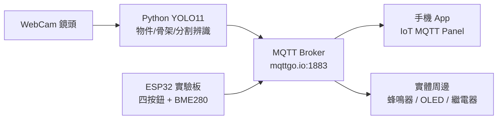

# 【專題製作 / 教師研習】ESP32 與 MQTT 智慧控制教學實戰講義

> **課程主講**：簡樹桐 老師  
> **課程主題**：115-09-14 AI 課程全輯：ESP32 與 MQTT 智慧控制教學實錄  
> **適用對象**：高中職專題製作課程、資訊科/電機科/電子科物聯網實習、教師增能研習  
> **配套資源**：教學投影片 [`ESP32_MQTT_智慧控制教學_教學投影片.pptx`](file:///j:/我的雲端硬碟/antigravity/教師研習/ESP32_MQTT_智慧控制教學_教學投影片.pptx) ｜ 網頁下載 [`esp32_mqtt_slides.pptx`](file:///j:/我的雲端硬碟/antigravity/教師研習/esp32_mqtt_slides.pptx)

---

## 📌 目錄
1. [課程全景與核心學習理念](#1-課程全景與核心學習理念)
2. [【第 01 節課】ESP32 環境建置、BME 感測器與 OLED 顯示](#2-第-01-節課esp32-環境建置bme-感測器與-oled-顯示)
3. [【第 02 節課】四按鈕碼表電路 ＆ MQTT 雲端智慧控制](#3-第-02-節課四按鈕碼表電路--mqtt-雲端智慧控制)
4. [【第 03 節課】AI 視覺影像辨識初探與五步驟 SOP](#4-第-03-節課ai-視覺影像辨識初探與五步驟-sop)
5. [虛實整合：從邊緣感測到雲端 AI 專題應用](#5-虛實整合從邊緣感測到雲端-ai-專題應用)
6. [專題評分規準 (Rubrics) 與現場避坑指南](#6-專題評分規準與現場避坑指南)
7. [教師專用：課堂提示語 (Prompt) 快速取用速查表](#7-教師專用課堂提示語-prompt-快速取用速查表)

---

## 1. 課程全景與核心學習理念

### 💡 1.1 破除對陌生物件的恐懼
* **傳統教學瓶頸**：看到完全沒學過的感測器晶片（例如 BME280），學生第一反應常是退縮，不知接腳意義與內部暫存器。
* **AI 賦能學習**：透過提示詞工程向 AI 詢問晶片功能、接腳與測試代碼，「不需死記暫存器，直接請 AI 提供引腳定義與測試程式」，快速將陌生零件整合至專題中。

### ⚙️ 1.2 硬體插拔防呆安全準則
* **平行拔插原則**：ESP32 板卡排針與 Type-C 傳輸線容易因施力不當斷裂。插拔時務必保持**水平平行**用力，**嚴禁向上向下折彎（撩拔）**，防止接頭鬆脫損壞。

### 🛡️ 1.3 AI 代理人開發權限設定（避免頻繁確認中斷）
* 在 AI 開發工具（如 Antigravity / Cursor 等）中：
  1. **Security / Permission Reset**：設為 `Custom`。
  2. **Outside of Project**：設為 `Allow`。
  3. **Terminal Command Auto Execution**：設為 `Always Proceed`（自動執行終端命令）。
  4. 讓 AI 能流暢自主編譯與運行測試，避免學生每次都被詢問確認打斷思緒。

---

## 2. 【第 01 節課】ESP32 環境建置、BME 感測器與 OLED 顯示

### 🎯 2.1 學習目標
* 理解 I2C 串列通訊協定（SCL 時脈線、SDA 數據線）之匯流排並聯架構。
* 掌握 BME280 感測模組量測物理量（溫度、相對濕度、大氣壓力 hPa）。
* 實作 MicroPython 驅動 SSD1306 OLED 螢幕即時輪播環境監測數據。

### 🔌 2.2 接線腳位配置
| 元件接腳 | ESP32 開發板腳位 | 說明 |
| :--- | :--- | :--- |
| **BME280 VCC** | `3.3V` | 系統供電 |
| **BME280 GND** | `GND` | 共地 |
| **BME280 SCL** | `GPIO 22` | I2C 時脈線 |
| **BME280 SDA** | `GPIO 21` | I2C 數據線 |
| **OLED SCL** | `GPIO 22` | 並聯共用 I2C SCL |
| **OLED SDA** | `GPIO 21` | 並聯共用 I2C SDA |

### 📋 2.3 實戰 Prompt 提示語

#### 【Prompt 1-1】陌生感測器快速探索與引導
```text
我手邊有一顆陌生的感測模組，上面標示『BME』，腳位有 VCC, GND, SCL, SDA。
請扮演資深物聯網硬體導師：
1. 告訴我這顆感測器主要能測量哪些物理量？（例如溫濕度、大氣壓力）
2. 我使用的是 ESP32 實驗板，請告訴我如何將它與 I2C 腳位（GPIO 21, 22）進行實體接線？
3. 請使用 MicroPython 撰寫一段簡單的掃描 I2C 位址（i2c.scan()）與數值讀取測試代碼。
```

#### 【Prompt 1-2】BME280 數值讀取並即時顯示於 OLED 螢幕
```text
請替 ESP32 撰寫 MicroPython 程式：
1. 同時驅動 BME280 感測器與 0.96 吋 SSD1306 OLED 螢幕（兩者皆接在 I2C: SCL 22, SDA 21）。
2. 每隔 1 秒讀取一次環境數值，並在 OLED 螢幕上清晰顯示三行數據：
   - 第一行：『Temp: XX.X C』
   - 第二行：『Humi: XX.X %』
   - 第三行：『Pres: XXXX.X hPa』
3. 包含完整例外防呆機制（若讀取失敗顯示 'Sensor Error'，不可當機閃退）。
```

---

## 3. 【第 02 節課】四按鈕碼表電路 ＆ MQTT 雲端智慧控制

### 🎯 3.1 學習目標
* 理解實體按鍵**低電位動作 (Active Low)** 與 ESP32 內部上拉電阻（`Pin.PULL_UP`）機制。
* 實作四按鈕多功能碼表（開始/暫停、計圈、歸零、模式切換）。
* 掌握物聯網核心協定 **MQTT**（發布 Publish / 訂閱 Subscribe / Broker）。
* 透過手機 App **IoT MQTT Panel** 建立雲端圖形化控制儀表板。

### ⏱️ 3.2 四按鈕腳位與功能定義
| 按鈕編號 | ESP32 GPIO | 模式設定 | 功能行為 |
| :--- | :--- | :--- | :--- |
| **PB1** | `GPIO 14` | `IN, PULL_UP` | 開始計時 / 暫停計時 (Start / Pause) |
| **PB2** | `GPIO 27` | `IN, PULL_UP` | 記錄當前圈數時間 (Lap Time) |
| **PB3** | `GPIO 26` | `IN, PULL_UP` | 碼表歸零 (Reset) |
| **PB4** | `GPIO 25` | `IN, PULL_UP` | 切換主計時畫面與歷史圈數列表 |

### ☁️ 3.3 MQTT 雲端設定三要素（簡老師課堂強調必抄重點）
1. **Broker 伺服器網址**：`mqttgo.io`（**注意：字元必須全對，不可漏打點**）。
2. **傳輸通訊埠 (Port)**：`1883`（標準 TCP 通訊）。
3. **Client ID 與 Topic 設計**：
   - Client ID 務必加上座號（如 `student_08_esp32`），防止同班同學彼此撞名互相踢除斷線。
   - 訂閱控制主題：`school/esp32/cmd`（接收手機 App 按鈕送出的指令）。
   - 發布狀態主題：`school/esp32/status`（將碼表秒數推播至手機 App 儀表板）。
4. **手機端 App**：在 App Store / Google Play 搜尋安裝 **IoT MQTT Panel**（帶有房子圖示的免費版）。

### 📋 3.4 實戰 Prompt 提示語

#### 【Prompt 2-1】四按鈕低電位動作之 OLED 碼表控制程式
```text
請替 ESP32 編寫一個功能完備的 MicroPython 碼表程式：
1. 硬體配置：0.96 吋 OLED (I2C: 21, 22)，四顆實體按鈕接在 GPIO 14, 27, 26, 25（啟用內部 PULL_UP，低電位觸發）。
2. 按鈕邏輯：
   - PB1 (GPIO 14)：開始計時 / 暫停計時
   - PB2 (GPIO 27)：記錄當前圈數時間 (Lap Time)
   - PB3 (GPIO 26)：碼表歸零 (Reset)
   - PB4 (GPIO 25)：切換主畫面與歷史圈數列表
3. 需具備軟體防彈跳 (Debounce) 機制，確保按鍵靈敏且不重送，以毫秒精度即時刷新螢幕。
```

#### 【Prompt 2-2】ESP32 連線 MQTT (mqttgo.io) 與手機 App 雙向控制
```text
請編寫 ESP32 MicroPython 程式，結合 Wi-Fi 與 MQTT 協定：
1. 連線至 Wi-Fi（指定 SSID 與 Password），連線成功後在 OLED 顯示配發的 IP。
2. 連接至 MQTT 伺服器：Broker 為 'mqttgo.io'，Port 為 1883，Client ID 為 'esp32_iot_node'。
3. 訂閱主題 'school/esp32/cmd'：
   - 收到 'START' 啟動碼表計時
   - 收到 'STOP' 停止計時
   - 收到 'RESET' 碼表歸零
4. 發布主題 'school/esp32/status'：每秒將當前碼表時間推播回 MQTT，供手機端即時顯示。
5. 提供完整代碼與手機 IoT MQTT Panel 儀表板設定指引。
```

---

## 4. 【第 03 節課】AI 視覺影像辨識初探與五步驟 SOP

### 🎯 4.1 學習目標
* 掌握電腦視覺開發 5 步驟標準 SOP。
* 實現 YOLO11 輕量模型即時推論與三合一模式切換。
* 實作畫面各類別物件總數即時統計面板。
* 掌握「截圖給 AI (Screenshot Debug)」之除錯心法。

### 📋 4.2 視覺實作五步驟 SOP
1. **步驟 1：硬體與 Python 環境檢查**（確認 WebCam 驅動就緒、OpenCV 與 Ultralytics 套件正常）。
2. **步驟 2：三種核心模式切換**：
   - 按 `1`：**通用物件偵測 (Object Detection)**，支援 COCO 80 類常見物件。
   - 按 `2`：**人體姿態骨架 (Pose Estimation)**，定位 17 處人體關鍵點。
   - 按 `3`：**實例分割去背 (Instance Segmentation)**，繪製物體輪廓多邊形遮罩。
3. **步驟 3：即時分類數量統計**：在視窗半透明看板中，統計畫面中人、桌子、椅子、筆電、杯子總數。
4. **步驟 4：截圖除錯 (Screenshot Debug)**：若畫面報錯或無法顯示，直接截圖貼回給 AI，AI 自動診斷修復。
5. **步驟 5：物聯網整合發想**：思考將視覺結果（特定手勢、特定物品）透過 MQTT 觸發 ESP32 警報。

### 📋 4.3 實戰 Prompt 提示語

#### 【Prompt 3-1】OpenCV + YOLO11 三合一模式切換與繁體中文標籤
```text
請使用 Python、OpenCV 與 Ultralytics YOLO11 開發即時 WebCam 視覺程式：
1. 自動開啟相機串流，並支援鍵盤熱鍵動態切換三種模式：
   - 按 '1'：通用物件偵測模式（yolo11n.pt），偵測 80 種常見物品
   - 按 '2'：人體姿態骨架模式（yolo11n-pose.pt），繪製 17 處關節點骨架
   - 按 '3'：實例分割模式（yolo11n-seg.pt），繪製物體輪廓多邊形遮罩
2. 畫面文字標籤必須使用系統微軟正黑體顯示【繁體中文】（如：人、椅子、瓶子、筆記型電腦）。
3. 畫面左上角顯示當前模式名稱與即時 FPS 幀率，按 'q' 鍵退出。
```

#### 【Prompt 3-2】現場物件分類數量即時統計看板
```text
請在上述 YOLO 辨識程式中新增【物件分類總數即時統計面板】：
1. 即時遍歷畫面中所有被偵測到的物件，統計各類別的出現數量（例如：人 x 5, 椅子 x 8, 杯子 x 2, 螢幕 x 3）。
2. 在畫面右上方半透明資訊欄中，由多到少即時列出統計清單與畫面總物件數。
3. 當偵測到『人』的數量發生變化時，在終端機印出警示日誌。
4. 代碼需優化推論速度，避免因統計運算導致畫面掉幀。
```

---

## 5. 虛實整合：從邊緣感測到雲端 AI 專題應用



* **專題應用範例**：
  1. **自走車/視障避障輔助**：鏡頭辨識人臉或障礙物，透過 MQTT 傳遞方向指示給 ESP32 馬達驅動板。
  2. **智慧居家手勢控制**：鏡頭辨識使用者舉起右手或特定手勢，推播指令關閉 ESP32 所控制的智慧燈具。
  3. **工廠人流與安全帽監控**：即時統計產線人數，未配戴安全帽時發送 MQTT 封包觸發現場警報器。

---

## 6. 專題評分規準與現場避坑指南

### 📊 6.1 評分規準 (Rubrics)
| 項目 | 佔比 | 評分指標 |
| :--- | :---: | :--- |
| **電路接線與防護** | 25% | I2C 匯流排並聯正確，按鈕接地電位動作正確，無插反或折彎杜邦線。 |
| **MQTT 雲端通訊** | 25% | 能成功連上 `mqttgo.io`，手機 App 能雙向收發控制指令與狀態推播。 |
| **視覺模型與統計** | 25% | YOLO11 三模式流暢切換，繁體中文標籤正常，分類數量統計精確。 |
| **AI 提示詞工程素養** | 25% | 能清楚使用 Prompt 引導 AI 修復問題，具備規格化提問能力。 |

### ⚠️ 6.2 現場除錯避雷清單
1. **排針嚴禁折彎**：杜邦線拔除請平行施力，切勿向上撩拔。
2. **Broker 網址檢查**：確保輸入為 `mqttgo.io`，Port 為 `1883`。
3. **Client ID 不可重複**：兩人使用相同 ID 會導致互相踢除斷線。
4. **Error 善用截圖**：遇到無法解決的報錯，直接將螢幕畫面截圖貼回 AI，由 AI 自動除錯！

---

## 7. 教師專用：課堂提示語 (Prompt) 快速取用速查表

```text
========================================================================
【通關密語：除錯自動修復指令】
每次開發完程式，請做程式功能的自我檢核，若有報錯或異常請直接修正代碼並提供修正說明。
========================================================================

【階段一：陌生感測器與 OLED】
我是高職學生，使用 ESP32 與 MicroPython。請教我如何接線並讀取 BME280 溫濕度大氣壓感測器，並將數值即時顯示於 0.96 吋 I2C OLED 螢幕上。

【階段二：四按鈕碼表】
請使用 MicroPython 為 ESP32 撰寫一個碼表，使用 4 顆低電位按鈕（GPIO 14, 27, 26, 25，內建上拉），實現開始、暫停、計圈、歸零，並於 OLED 顯示。

【階段三：MQTT 雲端手機遙控】
請教我用 MicroPython 連上 Wi-Fi 與 MQTT 伺服器 mqttgo.io (Port 1883)，手機使用 IoT MQTT Panel 發布指令開關 LED，並將感測數值定期推播回手機。

【階段四：YOLO11 三合一視覺與統計】
請使用 Python OpenCV 與 YOLO11 輕量模型，做一個相機程式：按 1 切換物件偵測、按 2 切換骨架姿勢、按 3 切換去背分割，並即時統計畫面中所有物件總數量。
========================================================================
```
